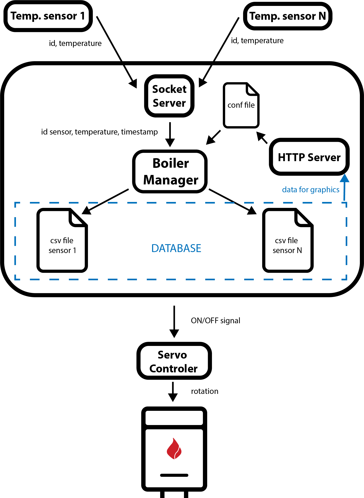

# BOILER ROOM

Boiler Room is a set of devices aimed to control ignition of boilers according to temperature sensors spread accross the house. 
The master is a RaspPi 3 and the slaves (ESPs, Arduinos, ...) are connected via Wi-Fi to the master.
The master receive the temperature data from the slaves and computes whether the boiler should be on or off.
As of v0, the app will be a Django app that can be easily accessed via web browsers on other devices. It triggers a servomotor that turns the boiler switch.
In the future, a database will be implemented as well as an advanced responsive UI.

# v1 scheme for the future

# v0 Roadmap

- [x] Install latest version of Python 3
- [x] Control servo with raspberry pi according to bool?
- [x] Install Django and create app
- [ ] Read temperature on ESP8266
- [ ] Set communication between master and slaves
- [ ] Build Apache production server

# Notes

As of v0 BoilerManager is a Django webapp that only controls the GPIO of the RPi.
In the future, it will monitor sensors data as well as perform the computations for the tempratures.

